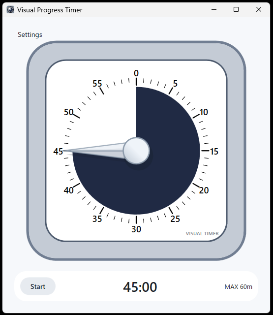
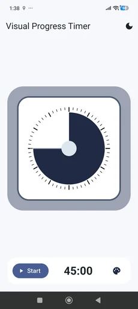

# Visual Progress Timer

Visual Progress Timer is a lightweight timer inspired by visual time timers. The remaining time is shown as a colored area on a simple clock face, so you can understand progress at a glance without reading a digital timer.

**このリポジトリには Windows 版と Android 版の両方が含まれています。**

This repository contains both a Windows desktop app and an Android app.

| Platform | Directory | Technology |
|----------|-----------|------------|
| Windows  | [`VisualProgressTimer/`](VisualProgressTimer/) | C# / WPF / .NET 10 |
| Android  | [`VisualProgressTimerAndroid/`](VisualProgressTimerAndroid/) | Flutter / Kotlin |

---

## スクリーンショット / Screenshots

| Windows | Android |
|---------|---------|
|  |  |

---

## Windows 版 / Windows App

### 概要

残り時間を時計の文字盤上の色付きエリアで表示する、シンプルな Windows デスクトップタイマーです。デジタル表示を読まなくても、一目で進捗が把握できます。

### 機能 / Features

- 60分対応のビジュアルタイマー
- 文字盤をドラッグして残り時間を設定
- マウスホイールで1分単位の微調整
- カウントダウンの開始・停止
- タイムアップ通知とアラーム音
- タイマー面・フレームのカラーテーマ
- ライト／ダークモード
- 最前面表示モード
- フローティングモード（タイマーのみのミニマル表示）

### 操作方法 / Controls

- 文字盤をドラッグして1〜60分の範囲で時間を設定します。
- マウスホイールで1分単位の調整ができます。
- `Start` ボタンでカウントダウンの開始・停止を切り替えます。
- `Settings` でカラー、ダークモード、最前面表示、フローティングモードを変更できます。
- フローティングモード中は `Esc` で通常モードに戻ります。
- フローティングモード中は右クリックドラッグでウィンドウを移動できます。

### 動作環境 / Requirements

- Windows
- .NET 10 SDK（開発時）

### ビルド / Build

```powershell
dotnet build VisualProgressTimer\VisualProgressTimer.csproj
```

### 実行 / Run

```powershell
dotnet run --project VisualProgressTimer\VisualProgressTimer.csproj
```

### 発行 / Publish

自己完結型の Windows x64 ビルド:

```powershell
dotnet publish VisualProgressTimer\VisualProgressTimer.csproj -c Release -r win-x64 --self-contained true
```

発行先:

```text
VisualProgressTimer\bin\Release\net10.0-windows\win-x64\publish
```

---

## Android 版 / Android App

### 概要

Flutter で実装した Android 版です。タイマーの状態は絶対的な終了時刻をベースに管理しており、Flutter UI が非アクティブな状態でも終了通知が発火するよう、Kotlin プラットフォームチャンネル経由で Android の `AlarmManager` を使用しています。

### 実行 / Run

```powershell
flutter pub get
flutter run
```

### 注意事項 / Notes

- Android 13 以降では通知パーミッションが必要です。
- Android 12 以降では正確なアラームパーミッションが必要な場合があります。
- 正確なアラームパーミッションが拒否された場合でもビジュアルタイマーは動作しますが、終了通知のタイミングが不正確になることがあります。

---

## アセット / Assets

アプリアイコン:

- `VisualProgressTimer/Assets/AppIcon.ico`
- `VisualProgressTimer/Assets/AppIcon.png`

---

## ライセンス / License

License not selected yet.
